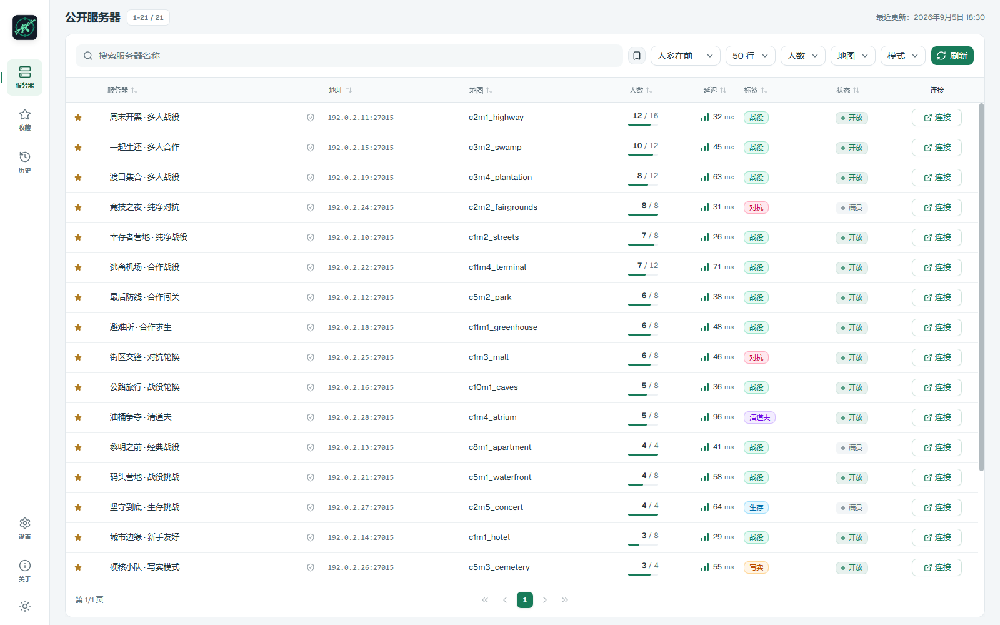
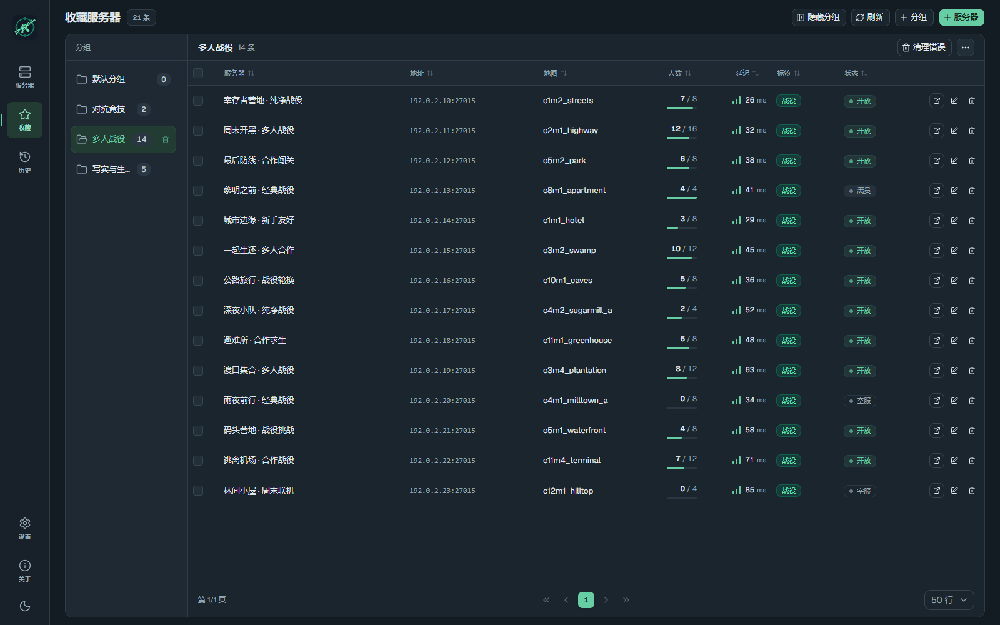

<p align="center">
  
</p>

<h1 align="center">L4D2 Server Hub</h1>

<p align="center">浏览服务器、管理收藏，快速加入下一场《求生之路 2》游戏。</p>

<p align="center">
  <a href="README.md">English</a> · 简体中文
</p>

<p align="center">
  <a href="https://github.com/josexy/l4d2serverhub/releases/latest">下载安装</a> ·
  <a href="#本地开发">从源码构建</a> ·
  <a href="https://github.com/josexy/l4d2serverhub/issues">反馈问题</a>
</p>

L4D2 Server Hub 是一款基于 Tauri、React 和 Rust 的《求生之路 2》桌面服务器浏览器与启动器。你可以搜索公共服务器，查看地图与在线人数，整理收藏，并通过 Steam 连接游戏。收藏、历史记录与偏好设置使用 SQLite 保存在本地。

## 功能

- **服务器浏览**：按名称搜索，按在线人数、官方／第三方地图和游戏模式筛选，支持排序及自定义 IP／文本黑白名单。
- **服务器详情**：在侧栏或独立窗口中查看服务器信息与玩家列表；保持详情视图打开，可等待空位提醒或自动连接。
- **收藏管理**：支持分组、自定义名称、备注、标签，以及批量移动和删除。
- **历史记录**：快速回到最近连接的服务器，复用之前的搜索词。
- **直接查询**：通过 Source A2S UDP 刷新已知服务器，也可切换为上游 HTTP 查询。
- **外观偏好**：支持英文和简体中文，以及跟随系统、浅色、深色主题；侧栏主题按钮自动保存选择，并与设置页同步。
- **本地备份**：通过 JSON 导入和导出设置、分组、收藏与连接历史。

## 程序截图

以下截图来自当前程序前端，使用示例服务器数据展示界面。截图对应开发中的版本，已发布版本的外观可能有所不同。

### 公共服务器 · 浅色主题



<details>
<summary><strong>收藏与分组 · 深色主题</strong></summary>



</details>

## 下载安装

前往 [GitHub Releases](https://github.com/josexy/l4d2serverhub/releases/latest)，下载对应平台的程序包。

| 平台 | 程序包 |
| --- | --- |
| Windows x64 | MSI 安装包、免安装 ZIP |
| macOS，Apple Silicon 与 Intel | 通用版本 DMG、应用 ZIP |
| Linux x64 | AppImage、DEB、RPM |

Windows 需要安装 [Microsoft Edge WebView2 Runtime](https://v2.tauri.app/start/prerequisites/#webview2)。macOS 发布包采用 ad-hoc 签名，尚未经过 Apple 公证。

连接服务器需要当前系统上可正常运行的 Steam 和《求生之路 2》。程序通过 `steam://connect/host:port` 唤起连接，不包含游戏本体。

## 快速上手

1. 打开 **服务器**，搜索或筛选公共服务器列表。
2. 点击服务器名称查看详情，或点击 **连接** 通过 Steam 加入游戏。
3. 点击星标收藏服务器；在 **收藏** 中管理分组、手动添加地址、编辑备注和标签。
4. 在 **历史** 中回到之前连接过的服务器。
5. 在 **设置** 中调整语言、查询方式、超时、代理和备份；**关于** 下方的图标可循环切换跟随系统、浅色和深色主题。

关闭主窗口会将程序隐藏到系统托盘。通过托盘菜单可以重新打开窗口或退出程序。

## 数据与网络

### 本地存储和备份

数据库文件 `l4d2-server-hub.sqlite` 保存在操作系统的应用数据目录中。Windows 免安装版本也使用该目录保存设置和服务器数据。

更换电脑或替换数据前，可先在 **设置** 中导出 JSON 备份。导入会先校验备份内容，再 **替换现有设置、分组、收藏和连接历史**。搜索历史不包含在备份中。

### 服务器查询

公共服务器的发现、搜索、筛选、排序和分页使用 [zhrradiant.com](https://zhrradiant.com) 提供的 L4D2 服务器列表服务，感谢其维护者为社区提供服务器数据。

对于已知地址，设置中的查询方式会用于服务器详情以及收藏／历史记录中的服务器刷新：

| 查询方式 | 连接目标 | 代理行为 |
| --- | --- | --- |
| A2S UDP | 直接查询游戏服务器 | 不使用 HTTP 代理 |
| HTTP | 查询上游服务 | 按设置使用无代理、系统代理或自定义代理 |

公共列表的可用性取决于上游服务。直接查询超时时，可检查 UDP 连通性与设置中的 A2S 超时；修改 HTTP 代理不会影响 UDP 流量。

## 本地开发

### 环境要求

- Node.js **22.12+** 和 npm；CI 使用 Node.js 22。
- 稳定版 Rust 工具链，包含 `rustfmt` 和 `clippy`。
- 当前操作系统所需的 [Tauri 2 系统依赖](https://v2.tauri.app/start/prerequisites/)。

### 启动开发环境

```bash
git clone https://github.com/josexy/l4d2serverhub.git
cd l4d2serverhub
npm install
npm run tauri dev
```

`npm run tauri dev` 会同时启动 Vite 前端和桌面程序。仅调整前端布局时，可用 `npm run dev` 在 `http://localhost:1420` 启动 Vite；服务器查询、数据持久化和 Steam 启动等功能需要 Tauri 后端。

### 构建与检查

```bash
# 构建前端资源
npm run build

# 构建桌面程序和平台安装包
npm run tauri build

# 运行后端测试与检查
cargo test --manifest-path src-tauri/Cargo.toml
cargo fmt --manifest-path src-tauri/Cargo.toml --check
cargo clippy --manifest-path src-tauri/Cargo.toml --all-targets -- -D warnings
```

默认的本地安装包输出到 `src-tauri/target/release/bundle/`。各平台的具体打包命令见 [发布工作流](.github/workflows/release.yml)。

### 技术栈与目录

| 层级 | 技术 |
| --- | --- |
| 桌面与后端 | Tauri 2、Rust、Tokio |
| 前端 | React 19、TypeScript、Vite |
| UI | Tailwind CSS 4、shadcn-style 组件、Radix UI、lucide-react |
| 存储与网络 | SQLite、sqlx、reqwest、rustls、Source A2S UDP |

```text
src/
  components/       应用组件与通用 UI 基础组件
  lib/              Tauri API 封装、类型、偏好设置与国际化
  pages/            服务器、收藏、历史、设置和关于页面
src-tauri/
  src/              命令、存储、服务器查询与 Steam 启动器
  tests/            Rust 集成测试
  icons/            程序图标
docs/screenshots/   README 截图
.github/workflows/  构建检查与发布打包
```

## 参与贡献

欢迎提交问题和 Pull Request。[反馈问题](https://github.com/josexy/l4d2serverhub/issues) 时，请附上操作系统、程序版本、复现步骤与相关错误信息。

请保持修改范围清晰，遵循仓库的 [开发约定](AGENTS.md)，并运行与变更相关的检查。前端改动应通过 `npm run build`，后端行为改动应补充确定性的 Rust 测试；涉及桌面集成时，使用 `npm run tauri dev` 验证实际运行效果。

## 许可证

本项目采用 [MIT 许可证](LICENSE)。
